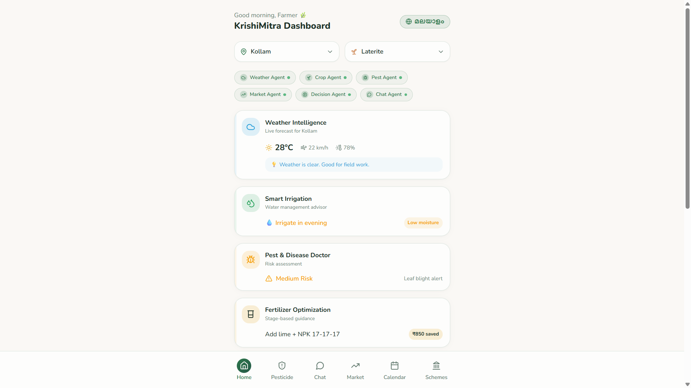
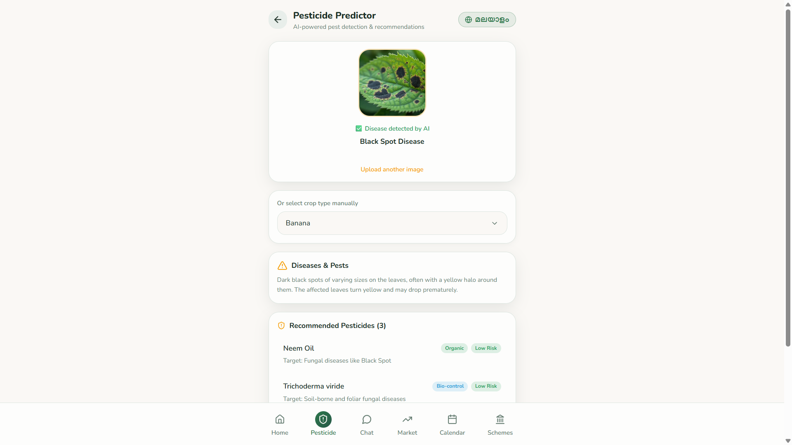
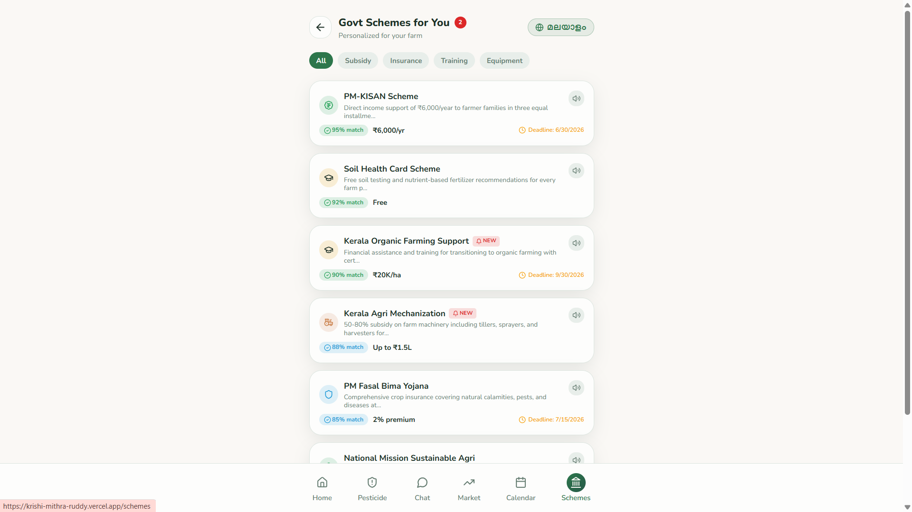

# 🌾 KrishiMithra – AI Powered Smart Farming Assistant

<p align="center">
  
  
  
  
  
</p>

## 🚀 Live Demo

🔗 **https://krishi-mithra-ruddy.vercel.app/**

---

# 📖 About

**KrishiMithra** is an AI-powered smart farming platform designed to assist farmers with modern agricultural practices. It provides an intuitive interface for accessing farming insights, crop management resources, and intelligent assistance through AI.

The project focuses on making agriculture smarter by combining modern web technologies with AI-driven features in a clean and responsive user experience.

---

# ✨ Features

- 🌾 Modern Agriculture Dashboard
- 🤖 AI Farming Assistant
- 🌤 Weather Information
- 🌱 Crop Recommendations
- 🐛 Pest Awareness
- 📊 User-Friendly Dashboard
- 📱 Fully Responsive Design
- ⚡ Fast Performance with Vite
- 🎨 Beautiful UI using Tailwind CSS & shadcn/ui

---

# 🛠 Tech Stack

### Frontend

- React
- TypeScript
- Vite
- Tailwind CSS
- shadcn/ui
- React Router

### Development Tools

- VS Code
- Git
- GitHub
- Vercel

---

# 📂 Project Structure

```text
KrishiMithra/
│
├── public/
├── src/
│   ├── components/
│   ├── pages/
│   ├── hooks/
│   ├── lib/
│   ├── assets/
│   └── App.tsx
│
├── package.json
├── vite.config.ts
└── README.md
```

---

# ⚙ Installation

Clone the repository

```bash
git clone https://github.com/HARINI-2007/KrishiMithra.git
```

Move into the project

```bash
cd KrishiMithra
```

Install dependencies

```bash
npm install
```

Run locally

```bash
npm run dev
```

Build production

```bash
npm run build
```

---

# 🌐 Deployment

The application is deployed on **Vercel**.

Live Website:

**https://krishi-mithra-ruddy.vercel.app/**

---

# 📸 Screenshots

## 🏠 Home Page

<p align="center">
  
</p>

---

## 🤖 AI Farming Assistant

<p align="center">
  
</p>

---

## 🌤 Weather Forecast

<p align="center">
  
</p>

---

## 🌾 Crop Calendar

<p align="center">
  
</p>

---

## 🐛 Pest Detection

<p align="center">
  
</p>

---

## 🏛 Government Schemes

<p align="center">
  
</p>
---

# 🎯 Future Improvements

- AI Chatbot Integration
- Real-time Weather API
- Disease Detection using AI
- Voice Assistant
- Farmer Authentication
- Crop Price Prediction
- Multilingual Support
- IoT Sensor Integration

---

# 👨‍💻 Developer

**HARINI M**

B.Tech Information Technology

Sri Manakula Vi nayagar Engineering College

---

# 🤝 Contributing

Contributions are welcome!

1. Fork the repository
2. Create a feature branch

```bash
git checkout -b feature-name
```

3. Commit changes

```bash
git commit -m "Added new feature"
```

4. Push

```bash
git push origin feature-name
```

5. Open a Pull Request

---

# ⭐ Support

If you found this project useful, please give it a ⭐ on GitHub.

---

## 📄 License

This project is developed for educational and research purposes.
